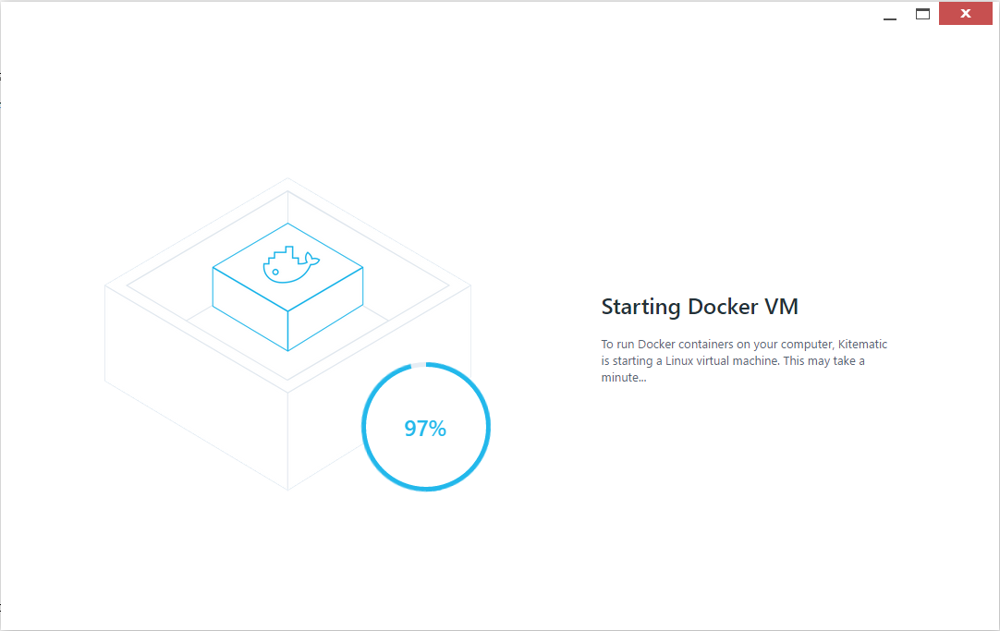

# Docker basics


**This document will wrote about the basics of docker container.<br>
本文件將簡述Docker 與 docker container的相關資訊與簡單的使用方式。**


## Content
* [Docker概念](#Docker概念)
* [Docker安裝](#Docker安裝)
* [Docker使用](#Docker使用)

-----------------------------------

#### Docker概念
### Docker concept

___________________________________

Docker 原概念為為了節省系統的龐大性並節省不必要且重複的底層環境而產生出的概念與架構。 基本上皆針對Linux系統所進行開發。

而Container的原始概念就是將環境包裝成一個封閉式環境，就像是貨櫃箱一樣。 將所有的環境與系統變數等鎖定在同一個Container裡。

之後，有人就想到了將兩個概念與做法進行結合，產生出Docker container的架構，並在部分需求的狀況下，提供少部分的開放性給Container。 可將外部的儲存空間掛載(mount)至docker container內提供使用。

其整體架構為，將底層系統與部分共同性的部分直接成為HOST，而docker container的image只包裝非前述但所需之環境變數，程式與執行資訊等資料進行包裝，並直接以執行緒(Thrad)的角度來運作整個服務。

該[官網](https://www.docker.com/)如下圖所示。

 <br />

同時，建議初次使用的人可申請一個免費的[Docker Hub](https://hub.docker.com/)帳號，方便往後可下載相關的image或是相關開發上的使用。

 <br />

由於Docker目前已Linux的架構為主，因此若將Docker執行在windows系統上或是MAC OS上，其會使用[Vbox](https://www.virtualbox.org/)並結合kubernetes程式來管理並建置一個虛擬的Linux環境供docker使用。

此外，Docker本身有額外為windows版提供新的架構，除了使用Vbox外，此新版的結合了Windows內含的Hyper-V以執行更穩定的架構。

docker kubernetes如下圖所示。

 <br />

#### Docker安裝
### Docker Install

___________________________________


由於docker提供了不同平台的安裝，因此以下以不同的作業系統平台做簡單的介紹。

* Windows

請先至[官方](https://store.docker.com/editions/community/docker-ce-desktop-windows)下載安裝檔案，並同時確定Hyper-V已於電腦上安裝並啟用。

*注意: Hyper-V軟體，微軟只提供非家用版系統才可進行安裝與使用。

 <br />

若尚未安裝Hyper-V可進入系統的"開啟或關閉windows功能"的頁面進行安裝，如下圖所示。

 <br />

接著，安裝流程如以下所示。

 <br />

 <br />

 <br />

 <br />

 <br />

接著，只要看到Hyper-V manager裝好並有開啟一個新的VM就表示docker已成功安裝並開啟。

 <br />

* Windows(old ver)/Mac

請先至[官網](https://docs.docker.com/toolbox/toolbox_install_windows/#step-2-install-docker-toolbox)下載對應的系統版本。

同時須確認機器必須擁有64位元系統與[虛擬化功能(windows)](https://www.microsoft.com/en-us/download/details.aspx?id=592)。

接著，安裝流程如以下截圖所示。

 <br />

 <br />

 <br />

 <br />

 <br />

 <br />

 <br />

 <br />

當安裝完成後，桌面將會出現以下三個圖示

 <br />

接著我們須先執行Docker Quickstart Terminal

 <br />

 <br />

當看到以下訊息即可知道安裝已經完成

 <br />

接著，可執行kubernetes程式，它提供了一個良好的GUI介面以提供對docker container的管理到使用。

以下為初次設定kubernetes的截圖。

 <br />

依照指示選擇VirtualBox

 <br />

 <br />

 <br />

 <br />

接著，登入你的Dccker Hub帳戶

 <br />

當看到以下畫面時就表示安裝完成拉~~

 <br />

* Linux

根據不同的版本請使用不同的指令進行安裝

```bash
# Ubuntu(deb系)
sudo apt-get update
sudo apt-get install docker.io 

#PS.官方是建議安裝docker-ce但我不太確定差距在哪，其實我個人用都沒出現錯誤資訊

# CentOS(rhel系)
sudo yum update
sudo yum install docker-io

# Fedora
sudo dnf update
sudo dnf install docker
```

安裝時會如下圖所示:

*以ubuntu為例

 <br />

接著，安裝完成後，若直接執行```docker```後若能出現以下結果即表示安裝完成

 <br />


#### Docker使用
### Docker Usage

___________________________________


