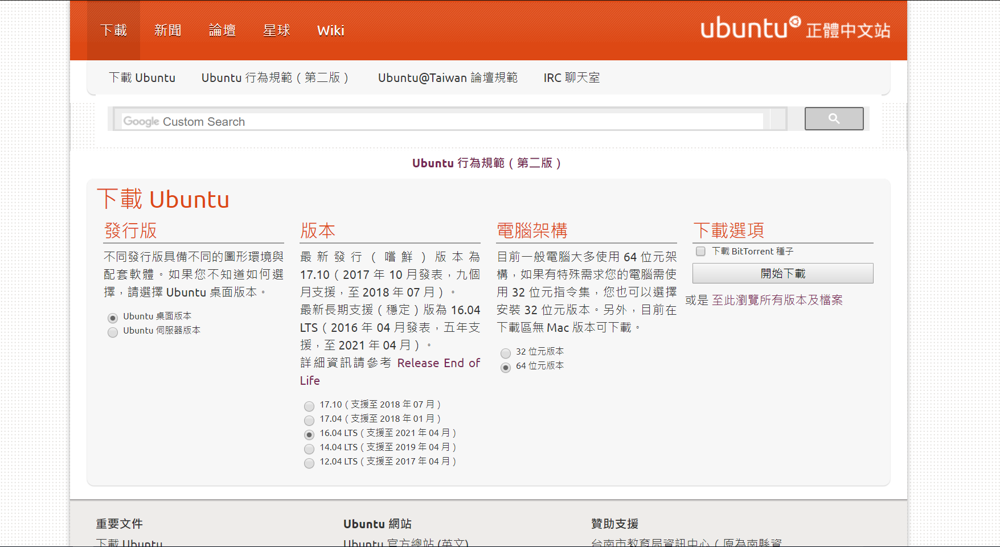
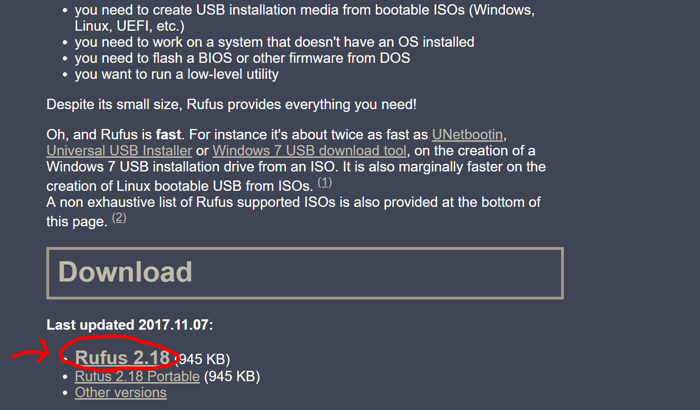

# System
# 系統環境

### Content
## 目錄

* [前置作業](#Pre-Process)
* [Ubuntu Server 16.04 LTS](#ubuntu-server-1604)
* [Ubuntu Server 14.04 LTS](#ubuntu-server-1404)

### Pre-Process
## 前置作業

安裝Ubuntu系統將需要下載對應的iso進行安裝，因此需連線至[ubuntu-tw官方網站](https://www.ubuntu-tw.org/modules/tinyd0/)下載對應的版本與系統。

 <br />

接著，將載下來的ISO以兩種方式皆可產生安裝媒體。

``` 方法1: ``` 
將ISO直接燒錄成光碟。

``` 方法2: ``` 
使用[Rufus軟體](https://rufus.akeo.ie/)建置安裝媒體，下載方式如下圖所示。 

 <br />

## Ubuntu 14.04 Server


## Ubuntu 16.04 Server