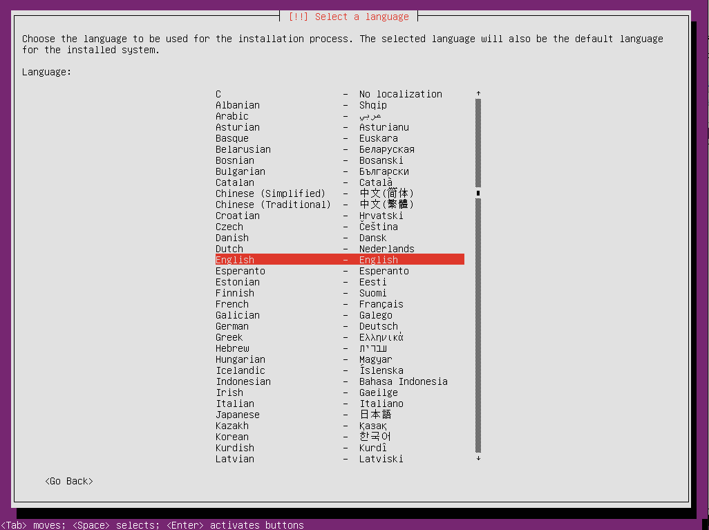
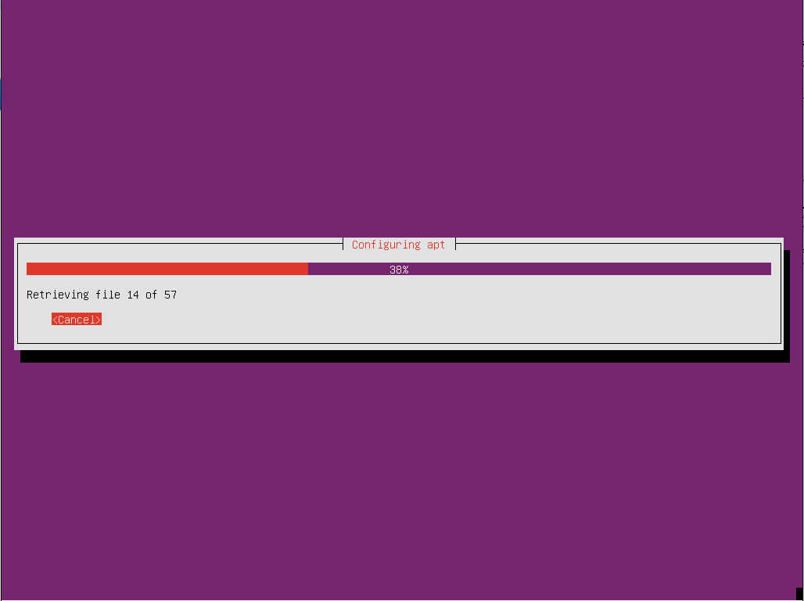

# System
# 系統環境

### Content
## 目錄

* [前置作業](#Pre-Process)
* [Ubuntu Server 16.04 LTS](#ubuntu-server-1604)
* [Ubuntu Server 14.04 LTS](#ubuntu-server-1404)

### Pre-Process
## 前置作業

安裝Ubuntu系統將需要下載對應的iso進行安裝，因此需連線至[ubuntu-tw官方網站](https://www.ubuntu-tw.org/modules/tinyd0/)下載對應的版本與系統。

 <br />

接著，將載下來的ISO以兩種方式皆可產生安裝媒體。

``` 方法1: ``` 
將ISO直接燒錄成光碟。

``` 方法2: ``` 
使用[Rufus軟體](https://rufus.akeo.ie/)建置安裝媒體，下載方式如下圖所示。 

 <br />

## Ubuntu 14.04 Server

* UEFI BIOS bootup (較新的主機板)

 <br />

* Legacy BIOS bootup (傳統開機方式)

 <br />

 <br />

接著安裝系統

選擇語言

 <br />

選擇地區

 <br />

選擇系統編碼

 <br />

選擇鍵盤配置

 <br />

 <br />

等待系統自動設定

 <br />

 <br />

 <br />

設定主機名稱

 <br />

建立使用者帳戶

 <br />

 <br />

 <br />

 <br />

決定是否將個人資料夾進行加密

 <br />

確認系統時區/時間

 <br />

 <br />

系統自動偵測硬碟/硬體配置

 <br />

建立硬碟分割 (LVM為logical volume manager，多數伺服器建置時為後期硬體擴充方便而選擇此選項)

(本次安裝只使用簡易的方式分割)

 <br />

選對要安裝的目標硬碟

 <br />

注:通常Linux會有SWAP分割區，建議大小為記憶體的1.5~2倍。

* UEFI BIOS bootup (較新的主機板)
* 此方法會自動採用GPT磁碟切割表並進行分割，主要明顯差異是比傳統多EFI開機區

 <br />

* Legacy BIOS bootup (傳統開機方式)
* 此方法會自動採用MBR磁碟切割表並進行分割

 <br />

系統開始自動安裝

 <br />

 <br />

接著，詢問是否要使用proxy進行系統更新(空白為不使用)

 <br />

系統更新中

 <br />

 <br />

決定系統是否往後自動更新

 <br />

決定需額外安裝的伺服器程式

 <br />

 <br />

安裝完成，系統將重啟

 <br />

 <br />

 <br />

## Ubuntu 16.04 Server

* UEFI BIOS bootup (較新的主機板)

* Legacy BIOS bootup (傳統開機方式)
