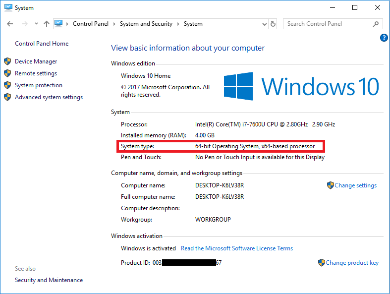
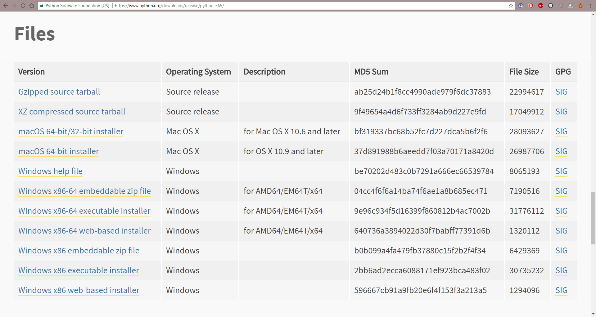
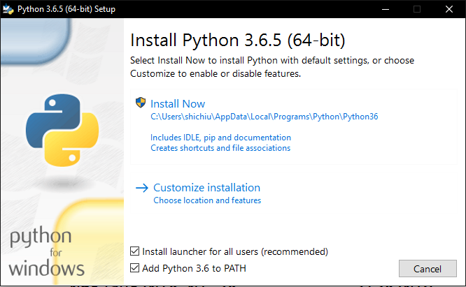
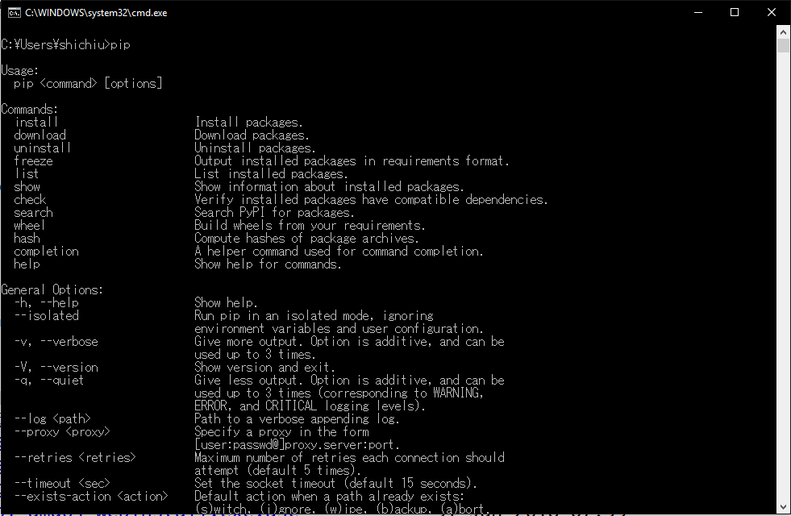
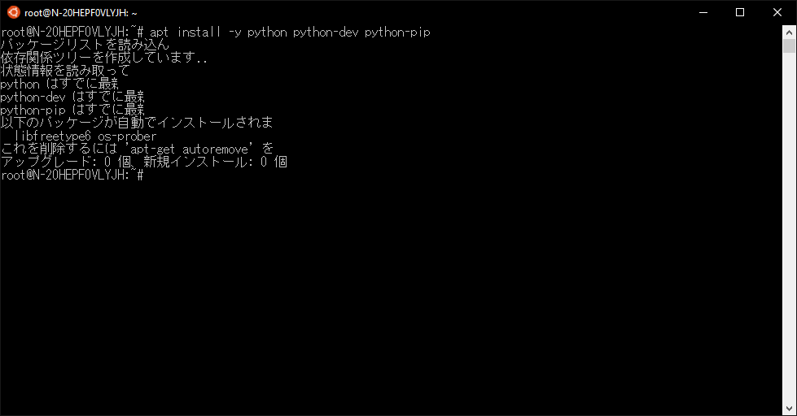
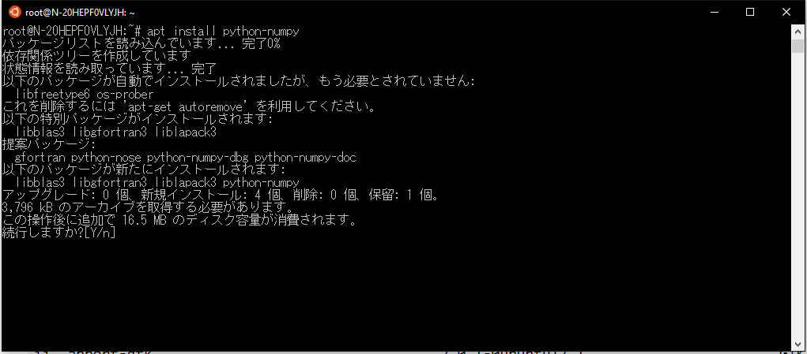
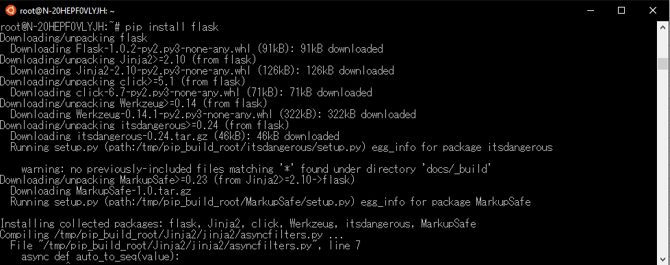
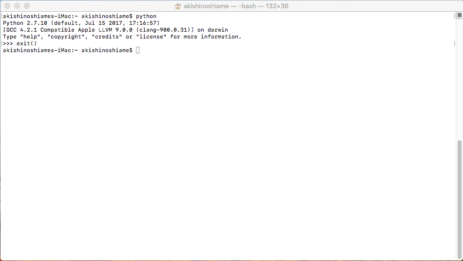
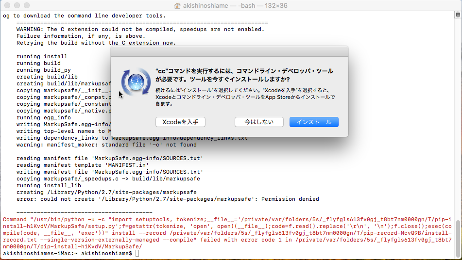

# Python Basics
# Python基礎與IDE

### Content
* [Python與版本](#python與版本)
* [Python函式庫](#python函式庫)
* [Python語言](#python語言)
* [Python編輯器](#python編輯器)

## Python與版本

Python 程式語言與其他以往的程式語言的邏輯上接近，但是程式的撰寫方式注重於排版。其編譯方式由排版的縮排架構進行解讀。

其中，包含幾個特點包含list架構，資料處理的便利性，與多元又開放的函式庫等等。

目前主流的是Python 3.4 與 3.5。　Python 2.7也是許多人在使用的，但因為有[相關資訊](https://www.python.org/dev/peps/pep-0373/)透露出2.7版要在近期內終止支援。

因此有人因此額外提供[相關網頁](https://pythonclock.org/)來Count Down Python 2的殘存時間。

現今，不論使用的是哪個版本，皆已有足夠的對應函式庫可供使用。

## Python函式庫

### メニュー
* 安裝與使用
  * Windows安裝方式
  * Linux(Ubuntu)安裝方式
  * Mac安裝方式
* 常用函式庫


* 安裝與使用
  * Windows安裝方式
  
  Python安裝方式建議直接從官方網站下載，並在安裝時注意相關的路徑與內建工具需勾選與安裝。
  
  根據系統不同請選擇對應的位元數進行安裝。 請參照Windows 設定中的系統做確認。
  
  
  
  對應下載頁面，選擇合適的安裝檔下載。
  
  
  
  確認安裝
  
  
  
  如果要加裝外部的函示庫，則開啟cmd使用內建提供之pip工具進行安裝。
  
  
  
  PS. 由於python本身會將不同版本分路徑安裝，因此若有開發需要可將多個不同版本的python安裝於同一電腦內。

* 安裝與使用
  * Linux(Ubuntu)安裝方式
  
  建議使用指令進行安裝，其相關完整安裝指令如下。
  
  ```bash
  
  #注意，根據不同的版本需求請將python換成"python2","python2.7","python3","python3.5"或"python3.6"等等
  
  sudo apt install python python-dev #python 主要套件
  sudo apt install python-pip #python 函式庫管理套件
  sudo apt install python-virtualenv #因應開發需求可額外安裝的套件
  
  ```
  
  
  
  同時，在ubuntu中有主要兩種套件安裝方式:
    * 使用apt進行安裝
	* 使用pip進行安裝
  
  在我個人使用上比較建議使用pip進行安裝，由於此工具為python官方提供之套件，並且版本通常比較新也可選擇特定版本安裝。
  
  ```bash
  #apt安裝方法
  sudo apt install -y python-??? #將"python-???"改成想安裝的lib名稱，Ex:"python-numpy"
  
  ```
  
  
  
  ```bash
  #pip安裝方法
  pip install ??? #將"???"改成要安裝的lib名稱，Ex:"numpy"
  
  ```
  
  

* 安裝與使用
  * Mac安裝方式
  
  mac本身預設是會安裝python2，如下圖所示。
  
  
  
  但此版本本身不含pip函式庫管理套件，因此需額外用指令進行安裝。
  
  ```bash
  
  sudo easy_install pip
  
  ```
  
  如此一來，即可直接使用pip指令進行套件安裝。
  
  
  
  同時，在使用pip安裝套件時會得知需要加裝Xcode才有辦法完整運作，因此需下載免費的Xcode套件
  
  
  
  如果要使用Python3，則常用的方式有兩種安裝方式：
	* Homebrew蘋果用套件管理程式
	* 官方GUI介面
  
  <br>
  
  **>Homebrew蘋果用套件管理程式<**
  
  根據Homebrew[官方](https://brew.sh/)網站所示，使用以下指令進行安裝Homebrew，接著可直接利用Homebrew快速安裝python3套件。
  
  ```bash
  
  /usr/bin/ruby -e "$(curl -fsSL https://raw.githubusercontent.com/Homebrew/install/master/install)" #安裝Homebrew
  
  brew update
  brew install python3 #更新與安裝python3
  
  ```
  
  **>官方GUI介面<**
  
  直接到官方下載mac專用安裝程式(.dmg)進行GUI安裝。

* 常用函式庫


## Python語言

以下簡單列舉Python程式語言的大致樣貌。

```
import os

if __name__ == "__main__":
	for i in range(10):
		print(i)

```

## Python編輯器

list
* 集合包
  * WinPython
  * Anaconda
* 純編譯器
  * IDLE
  * Spyter
  * PyCharm
  * Others