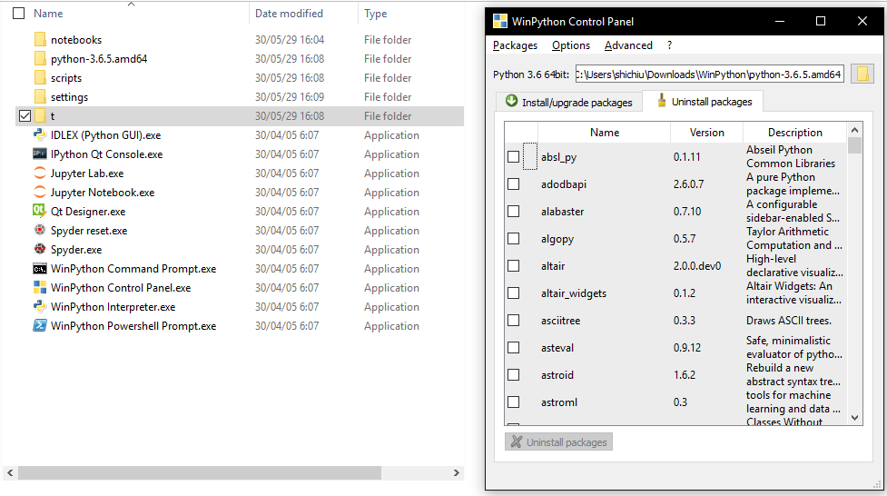

# Python Basics
# Python基礎與IDE

### Content
* [Python與版本](#python與版本)
* [Python函式庫](#python函式庫)
* [Python語言](#python語言)
* [Python編輯器](#python編輯器)

## Python與版本

Python 程式語言與其他以往的程式語言的邏輯上接近，但是程式的撰寫方式注重於排版。其編譯方式由排版的縮排架構進行解讀。

其中，包含幾個特點包含list架構，資料處理的便利性，與多元又開放的函式庫等等。

目前主流的是Python 3.4 與 3.5。　Python 2.7也是許多人在使用的，但因為有[相關資訊](https://www.python.org/dev/peps/pep-0373/)透露出2.7版要在近期內終止支援。

因此有人因此額外提供[相關網頁](https://pythonclock.org/)來Count Down Python 2的殘存時間。

現今，不論使用的是哪個版本，皆已有足夠的對應函式庫可供使用。

## Python函式庫

### メニュー
* 安裝與使用
  * Windows安裝方式
  * Linux(Ubuntu)安裝方式
  * Mac安裝方式
* 常用函式庫


* 安裝與使用
  * Windows安裝方式
  
  Python安裝方式建議直接從官方網站下載，並在安裝時注意相關的路徑與內建工具需勾選與安裝。
  
  根據系統不同請選擇對應的位元數進行安裝。 請參照Windows 設定中的系統做確認。
  
  
  
  對應下載頁面，選擇合適的安裝檔下載。
  
  
  
  確認安裝
  
  
  
  如果要加裝外部的函示庫，則開啟cmd使用內建提供之pip工具進行安裝。
  
  
  
  PS. 由於python本身會將不同版本分路徑安裝，因此若有開發需要可將多個不同版本的python安裝於同一電腦內。

* 安裝與使用
  * Linux(Ubuntu)安裝方式
  
  建議使用指令進行安裝，其相關完整安裝指令如下。
  
  ```bash
  
  #注意，根據不同的版本需求請將python換成"python2","python2.7","python3","python3.5"或"python3.6"等等
  
  sudo apt install python python-dev #python 主要套件
  sudo apt install python-pip #python 函式庫管理套件
  sudo apt install python-virtualenv #因應開發需求可額外安裝的套件
  
  ```
  
  
  
  同時，在ubuntu中有主要兩種套件安裝方式:
    * 使用apt進行安裝
	* 使用pip進行安裝
  
  在我個人使用上比較建議使用pip進行安裝，由於此工具為python官方提供之套件，並且版本通常比較新也可選擇特定版本安裝。
  
  ```bash
  #apt安裝方法
  sudo apt install -y python-??? #將"python-???"改成想安裝的lib名稱，Ex:"python-numpy"
  
  ```
  
  
  
  ```bash
  #pip安裝方法
  pip install ??? #將"???"改成要安裝的lib名稱，Ex:"numpy"
  
  ```
  
  

* 安裝與使用
  * Mac安裝方式
  
  mac本身預設是會安裝python2，如下圖所示。
  
  
  
  但此版本本身不含pip函式庫管理套件，因此需額外用指令進行安裝。
  
  ```bash
  
  sudo easy_install pip
  
  ```
  
  如此一來，即可直接使用pip指令進行套件安裝。
  
  
  
  同時，在使用pip安裝套件時會得知需要加裝Xcode才有辦法完整運作，因此需下載免費的Xcode套件
  
  
  
  如果要使用Python3，則常用的方式有兩種安裝方式：
	* Homebrew蘋果用套件管理程式
	* 官方GUI介面
  
  <br>
  
  **>Homebrew蘋果用套件管理程式<**
  
  根據Homebrew[官方](https://brew.sh/)網站所示，使用以下指令進行安裝Homebrew，接著可直接利用Homebrew快速安裝python3套件。
  
  

  ```bash
  
  /usr/bin/ruby -e "$(curl -fsSL https://raw.githubusercontent.com/Homebrew/install/master/install)" #安裝Homebrew
  
  brew update
  brew install python3 #更新與安裝python3
  
  ```
  

  

  

  

  **>官方GUI介面<**
  
  直接到官方下載mac專用安裝程式(.dmg)進行GUI安裝。

  

  

  

  

  安裝好後即可在終端機使用pip3安裝其他函式庫。

  

* 常用函式庫

[NumPy](http://www.numpy.org/):

數值計算使用，在較為大的數值運算，矩陣運算與多為矩陣處理非常好用。

同時，此函式支援及時更新與儲存功能。

[SciPy](https://www.scipy.org/):

某種程度上來說可算是為前一函式庫(NumPy)的進階版。

其中專注於科學上的計算與使用，像是一些既定公式都可以在此找到。

[Pandas](https://pandas.pydata.org/):

接近於資料分析工具，其中拿來做資料的前處理時是個好用的工具。

[Matplotlib](https://matplotlib.org/):

Python中其中一種繪圖程式，在資料處理中常被拿來做資料視覺化的工具。

其內建強大的不同圖表工具幫助資料快速視覺化。

[NTLK](https://www.nltk.org/):

自然語言處理相關的常用函式庫，主要是用來做字詞的"tokenlize"。

可以把自然語言轉換為數值形式方便儲存與運算。

[Gensim](https://radimrehurek.com/gensim/):

略為接近前者，主要用來進行自然語言的文本分析，從文本內抽出並計算詞向量。

支援常見的兩種詞向量計算與通用格式。

此外，目前他本身也支援作文本向量與句子向量運算，為自然語言處理中一極為便利的工具。

[Scrapy](https://scrapy.org/):

python中知名的爬蟲工具，內建極為強大的爬蟲用分析工具。

可針對諸多需求進行變形，抓取所需要的資料。並可同時爬取非文本資料。

[Flask](http://flask.pocoo.org/):

使用python語言建置的網頁伺服器，類似apache, IIS等伺服器之功能。

可直接用python語言結合網頁語言(HTML, JavaScript, CSS...)等等混合使用做出簡易又華麗的網頁。

也適合來做產生API介面之工具。

[Pickle](https://docs.python.org/3/library/pickle.html)/[cPickle](https://docs.python.org/2.5/lib/module-cPickle.html):

Python內建的一個資料序列化儲存工具。

適合用來將把訓練好的權重等資訊進行壓縮與序列化儲存到電腦中。

有需要的時候也可直接叫出來使用，概念有點像是7-zip的資料封存。

PS.其他相關深度學習之lib將另外獨立章節說明。

## Python語言

以下簡單列舉Python程式語言的大致樣貌。

```python3

# 以下為匯入函式庫的方式，此外python不限定只用系統安裝的，也可把寫好的py檔當成lib import
import os	#整包直接匯入，然後調用時直接使用os調用
import tensorflow as tf	#匯入後改名，使用時用tf調用
from numpy import random	#從整包的函式庫只匯入部分/單一function使用，調用時使用random調用
from keras.models import Sequential as kar_seq	#從整包的函式庫只匯入部分/單一function使用，調用時使用kar_seq調用

# 以下為變數宣告方式，python中的變數沒有預設宣告格式的功能。
values = [{"name": "Michelangelo", "food": "PIZZA"}, {"name": "Garfield", "food": "lasagna"}]
temp = 2
check = True


# def 開頭的為宣告function的功能，同時宣告後可直接被其他py檔案調用
def unpacker(name=None, food=None):
    return ["Hi, I'm {} and I love to eat {}!".format(name, food)]	#.format是一種python內建方便的功能，可以將對應的資訊往所要存放的位置塞入。

def string_factory(values):
    ans = []
    for value in values:	# for的其中一種方式，當value是陣列或是list時，python會自動抓取並一筆一筆丟入直到EoF。
        template = unpacker(**value)
        ans.extend(template)
    return ans

if __name__ == "__main__":
    result = string_factory(values) #調用def定義好的function，跟其他程式語言相同
    print(result)	#列印變數，將所要印的東西全都用()括起來，在python2只有"print result"的方式，無括弧。
	
	for i in range(10):	#for 抓取變數更新的另一種方式，從0開始到9，當到10會跳出迴圈。
		print(i)
		print(type(i), type(result))	#用type()內建函數可確認變數被給定的型態，並利用","可同時列印多個不同變數。

#別忘記python本身很重視排版，當縮排有錯將會導致執行錯誤。
```

## Python編輯器

list
* 集合包
  * WinPython
  * Anaconda
* 純編譯器
  * IDLE
  * Spyter
  * PyCharm
  * Others
  
  
* 集合包  
  [**WinPython**](http://winpython.github.io/)
  
  WinPython本身為windows平台包裝製成。
  
  此集成包非常方便，已經包裝好部分基礎所需要的套件。
  
  內建Spyter編輯器與函式庫管理套件。如下圖所示。
  
  
  
  內建所包含之library可由[這裡](https://github.com/winpython/winpython/blob/master/changelogs/WinPythonQt5-32bit-3.6.5.0.md)查詢。
  
  此外，除了截圖中的套件管理程式，pip也有包含在裡面可以使用。
  
* 集合包  
  [**Anaconda**](https://www.anaconda.com/download/)
  
  Anaconda相對於上述的WinPython，優勢相對高一點。由於其所支援的平台橫跨Windows/Liunx與macOS三種平台。
  
  如同WinPython一樣，此軟體也包含了諸多的預設lib套件。
  
  其介面如下圖所示:
  
  
  
  同時,Anaconda本身有很完整的GUI套件與其自行開發之管理介面，因此許多需要的工具皆可從其軟體首頁進行管理。
  
  預設安裝的lib套件資訊可由[官方的說明文件](https://docs.anaconda.com/anaconda/packages/pkg-docs)得知。
  
  另外，部分的指令管理有其自行[開發的指令](https://docs.anaconda.com/anaconda/user-guide/getting-started#write-a-python-program-using-anaconda-prompt-or-terminal)。
  
* 純編譯器  
  [**IDLE**](https://docs.python.org/3/library/idle.html)
  
  IDLE為官方內建的編譯器。在安裝Python官方的軟體時，預設會自動安裝置電腦中。
  
  此編譯器類似於linux中的vim套件，但同時也具備逐行檢查錯誤之功能。
  
  個人覺得不太好用，因此裝完後就直接擺在那邊不太使用。
  
  
  
* 純編譯器  
  [**Spyter**](https://pythonhosted.org/spyder/)
  
  Spyter是一個使用Python語言原生寫出來的編譯器，同樣支援Windows/Linux與macOS等多個平台。
  
  此編譯器本身有被包在WinPython與Anaconda中，同時在Ubuntu的Software Center中可直接下載安裝。
  
  此編譯器包含部分的Auto-Complete功能，在編輯與撰寫中可以提升效能。
  
  但缺點是他在Ubuntu等Linux系統上的會有語系轉換的問題，windows在部分的環境設置上也可能會遇到。
  
  其軟體截圖如下:
  
  
  
* 純編譯器  
  [**PyCharm**](https://www.jetbrains.com/pycharm/download/)
  
  此編譯器為朋友先推薦使用後我個人開始使用的編譯器。
  
  同樣支援多平台，且也算是蠻lightweight的系統。
  
  不論作為開發或是初期學習都算是個不錯的編譯器，由於官方很仁慈的額外提供了[教育版](https://www.jetbrains.com/pycharm-edu/)，內建學習資源可邊練邊學。
  
  個人使用上可使用Community版免費使用。
  
  其本身的風格類似VisualStudio的Project功能，建立一個資料夾為整個Python Project進行管理。
  
  
  
  此外，其還有兩個強大的功能，必須在此強烈推薦:
  
  1. 可自主選擇project所使用的python版本。
  
    在同一台電腦上，可同時因為不同的開發需求，安裝多個不同的python版本。
	
	同時，PyCharm會自動掃瞄並偵測所包含的所有版本。
	
	此外，library也是根據不同版本有獨立管理功能。
	
	
  
  2. 非常好用的lib管理介面。
  
    在這個介面上，他會列出所有它可收集到的library，可以同時勾選並一鍵安裝，這是對於開發者而言非常方便的功能。
  
    可以免去許多額外去官網或是上stacksverflow找尋安裝方法或安裝錯誤的解決方法。
    
     	
  
* 純編譯器  
  **Others**
  
  此處放置幾個個人聽過但鮮少使用的編譯器僅供參考，若有需要可自行研究。
  
  [Visual Studio Code](https://code.visualstudio.com/download):微軟所開發的跨平台編譯器，聽說受到蠻多coding朋友的愛戴。
  
  [Sublime Text](https://www.sublimetext.com/3):為一跨平台的超簡易編譯器，據說有段時間也很熱門。
  
  [Vim](https://www.vim.org/download.php):在Linux/UNIX與FreeBSD等系統中，文字介面裡很受歡迎的編譯工具。
  
  ...其他的等待有緣人幫忙推薦補充了(´･ω･｀)//
  
  