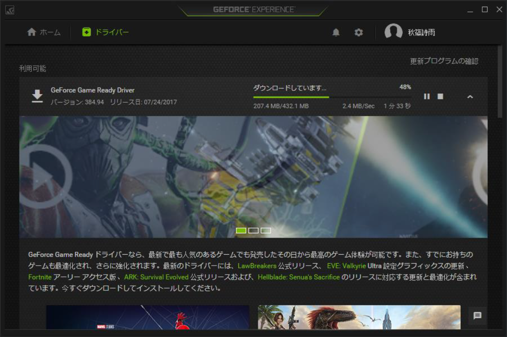
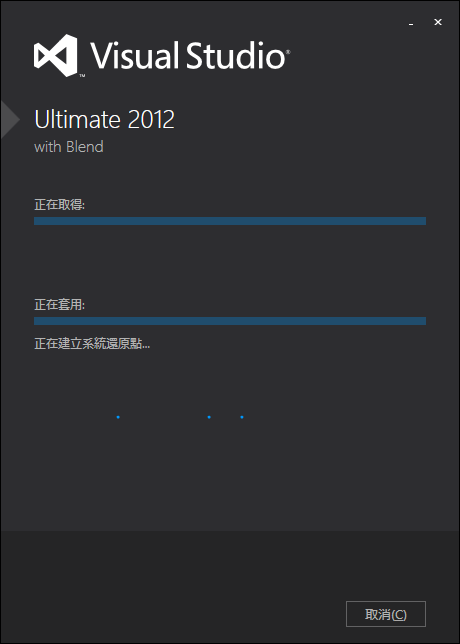
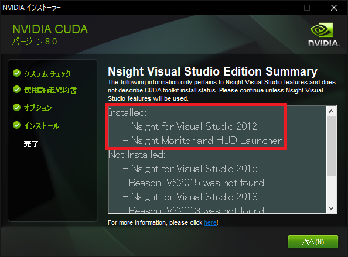
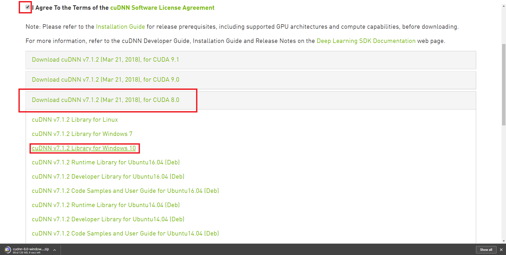

# GPU-CUDA
# GPU運算建置-CUDA

本章節就windows 10與Linux ubuntu 14.04/16.04安裝 CUDA的步驟與細節進行探討與整理。 此處須注意的是由於不同系統設計架構的關係，於windows上安裝時須同時事先安裝對應版本的Visual Studio以便系統進行編譯與執行。Linux上需注意的是對應的驅動版本與在Cuda安裝時產出對應的安裝選項。
底下將分兩個區塊進行講解。
同時，無論是在哪個平台安裝Cuda，須注意要額外再下載與安裝CuDnn，此為運行深度學習相關程式的必須套件，用以加速硬體運算效能。

### Content
## 目錄

* [Windows環境](#windows-cuda)
* [Linux環境](#linux-cuda)

<br />

# Windows Cuda

於windows上安裝Cuda前，需根據對應的顯卡硬體，事先檢查所持有的卡片是否支援。由[此處](https://developer.nvidia.com/cuda-gpus)或是利用型號尋找官方頁面得知是否支援。

接著，由官方的[系統需求](http://docs.nvidia.com/cuda/cuda-installation-guide-microsoft-windows/index.html)頁面對應使用的系統版本與確定對應需安裝的Visual Studio版本。


-----------------------------------------------------
##### 表格節錄，收錄時間 JST 30/03/16 請在安裝前注意ChangeLog


| Operating System       | Native x86_64 | Cross (x86_32 on x86_64)|
|:---------------------- |:-------------:|:-----------------------:|
| Windows 10             |    YES        |      YES                |
| Windows 8.1            |    YES        |      YES                |
| Windows 7              |    YES        |      YES                |
| Windows Server 2016    |    YES        |      NO                 |
| Windows Server 2012 R2 |    YES        |      NO                 |

| Compiler                   | IDE                          | Native x86_64 | Cross (x86_32 on x86_64) |
|:-------------------------- |:---------------------------- |:-------------:|:------------------------:|
| Visual C++ 15.0            | Visual Studio 2017           | YES           | NO                       |
| Visual C++ 14.0            | Visual Studio 2015           | YES           | NO                       |
|   --                       | Visual Studio Community 2015 | YES           | NO                       |
| Visual C++ 12.0            | Visual Studio 2013           | YES           | YES                      |
| Visual C++ 11.0            | Visual Studio 2012           | YES           | YES                      |
| Visual C++ 10.0 DEPRECATED | Visual Studio 2010           | YES           | YES                      |


-----------------------------------------------------

確認後，可先考慮從[官方](https://www.nvidia.com/en-us/geforce/geforce-experience/)安裝NVidia所提供的Geforce Experience，已讓軟體自動檢測並提供最新的驅動安裝


如下圖為Geforce Experience的驅動安裝畫面



根據官網所提供之資訊可知，在安裝顯卡CUDA 運算套件之前需先注意想安裝的版本與對應到的套件。通常在此須注意一下硬體版本，若顯卡為GTX 10XX 系列的建議安裝最新8.0 版，而倘若硬體為GeForce 9XX 或是GTX 9XX 系列建議安裝7.5 版，而其他的硬體設備請根據官方說明比照辦理。

在安裝CUDA 前請先注意電腦是否可拿來做顯卡運算，並留意不同版本在安裝前「一定必須」先裝對應支援版本之Visual Studio，避免CUDA 安裝不完全。根據上表說明可知，8.0 的CUDA 可裝Visual Studio 2015/2015 community/2013/2012/2010，而7.5 版支援Visual Studio
2013/2012/2010。

因此，請務必先安裝完對應之Visual Studio再行Cuda之安裝。



接著即可安裝CUDA Toolkit。並必須注意，安裝Toolkit 時需看到已下截圖之選項才能確保安裝時是完整的。



## 延伸安裝
## Expended install

Cudnn於windows安裝需先進入[Cudnn的下載網頁](https://developer.nvidia.com/cudnn)下載對應的版本進行安裝。
由於此檔案需要權限進行下載，因此請先到[此處](https://developer.nvidia.com/developer-program)加入免費的開發者會員。


接著，登入後將會顯示cuDNN Download的下載頁面，請根據對應的CUDA版本與想安裝的cuDNN版本進行選擇。如果是想安裝NVidia DIGITS 或是 Tensor Flow請參照對應的官方網站之建議進行安裝。



最後，將載下來的壓縮檔進行解壓縮，並複製到對應的PATH系統路徑以完成安裝。


```bash
Copy the following files into the CUDA Toolkit directory.
	Copy <installpath>\cuda\bin\cudnn64_7.dll to C:\Program Files\NVIDIA GPU Computing Toolkit\CUDA\<Version>\bin.
	Copy <installpath>\cuda\ include\cudnn.h to C:\Program Files\NVIDIA GPU Computing Toolkit\CUDA\<Version>\include.
	Copy <installpath>\cuda\lib\x64\cudnn.lib to C:\Program Files\NVIDIA GPU Computing Toolkit\CUDA\<Version>\lib\x64.
```

對應出處可參照[此處](http://docs.nvidia.com/deeplearning/sdk/cudnn-install/index.html#installwindows)。

##### .~.~.~.~.~.~.~.~.~.~.~.~.~.~.~.~.~.~.~.~.~.~.~.~.~.~.~.~.~.~.~.~.~.~.~.~.~.~.~.~.~.~.~.~.~.~.~.~.~.~.~.~.~.~.~.~.~.~.~.~.~.~.~.~.~.~.~.~.~.~.我是分隔線.~.~.~.~.~.~.~.~.~.~.~.~.~.~.~.~.~.~.~.~.~.~.~.~.~.~.~.~.~.~.~.~.~.~.~.~.~.~.~.~.~.~.~.~.~.~.~.~.~.~.~.~.~.~.~.~.~.~.~.~.~.~.~.~.~.~.~.~.~.~.

# Linux Cuda


