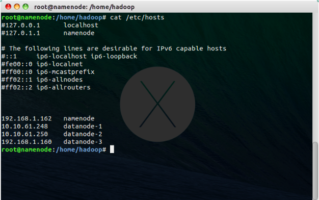

# Notes for Hadoop 1.2.1 install and build guide

In this note shows how to install the enviorment system for Linux Ubuntu 14.04 LTS and Hadoop 1.2.1. Also, list some issue we have faced and how to solve.

### Guide Line
* [System Install](#system-install)
    * [Install Ubuntu](#install-ubuntu)
    * [Setting Enviorment](#setting-enviorment)
* [Install Hadoop System](#install-hadoop-system)
    * [Install Dependencies](#install-dependencies)
    * [Install Hadoop](#install-hadoop)
    * [Run Hadoop](#run-hadoop)
* [Problem Solving](#problem-solving)

## System Install

In this section we used Ubuntu 14.04 LTS Desktop version for easy deployment. In real enviorment shuld use the Server Version.

### Install Enviorment 

Download and install Ubuntu.


** Be caution with the Computer-Name, it will be related to the hosts in foward deployment.

### Setting Enviorment

As the needed of different nodes to linked also hadoop self requeriment, we need to add some packages further.
We needs to install tasksel for managing and installing OpenSSH and LAMP. And don't forget to setup root password for MySQL in LAMP package.

``` Shell
sudo apt-get install tasksel
sudo tasksel
# select and install packages
```


## Install Hadoop System

In this section we are starting install the Hadoop.

### Install Dependencies

We needs to set up the RSA key-pairs and install Java to let the Hadoop works.

``` Shell
# Generating the RSA key pairs
ssh-keygen -t dsa –p “”
# for hadoop does not require key pairs
ssh-keygen -t dsa -P '' -f ~/.ssh/id_dsa
cat ~/.ssh/id_dsa.pub >> ~/.ssh/authorized_keys
# install java
sudo apt-get install openjdk-7-jdk
```


### Install Hadoop

Then we can started install Hadoop. Downloading from website and fixed some configuration.

``` Shell
# Download and Uncompress package.
wget https://archive.apache.org/dist/hadoop/core/hadoop-1.2.1/hadoop-1.2.1.tar.gz 
tar zxvf hadoop-1.2.1.tar.gz
# Setup Java location
# edit hadoop-env.sh and adding path with below code.
# probibly at line 10.
export JAVA_HOME=/usr/lib/jvm/java-7-openjdk-i386
```
``` XML
<!-- then editing three files with adding below codes one by one -->
<configuration>

  <property>
    <name>mapred.job.tracker</name>
    <value>localhost:9001</value>
  </property>

</configuration>
<!-- conf/mapred-site.xml -->
<configuration>

  <property>
    <name>dfs.replication</name>
    <value>3</value>
  </property>
  <property>
    <name>dfs.block.size</name>
    <value>10240</value>
  </property>

</configuration>
<!-- conf/hdfs-site.xml
 we changed the replication to 3 for 3 datanodes. -->
<configuration>

  <property>
    <name>fs.default.name</name>
    <value>hdfs://namenode/</value>
  </property>
  <property>
    <name>hadoop.tmp.dir</name>
    <value>/home/hadoop/hadoop1.2.1/hadoop_tmp</value>
  </property>

</configuration>
<!-- conf/core-site.xml -->
```

``` Shell
# also need to setup nodes. Using computer-name or called hostname.
namenode
# master
datanode-1
datanode-2
datanode-3
# slave
```


### Run Hadoop

Now we can start and run hadoop.

``` Shell
rm –rf hadoop_tmp/
bin/hadoop namenode –format
bin/start-all.sh
# using below commands to check the system is working
jps
# using command to stop
bin/stop-all.sh
```


## Problem Solving

issue 1 : hadoop auto on and control

===
http://wiki.ubuntu.org.cn/index.php?title=%E5%88%A9%E7%94%A8Cloudera%E5%AE%9E%E7%8E%B0Hadoop&variant=zh-tw
cloudera實現開機自啟動
===

issue 2 : showing error below

``` Shell
WARN hdfs.DFSClient: DataStreamer Exception: org.apache.hadoop.ipc.RemoteException: java.io.IOException: File /user/hadoop/PiEstimator_TMP_3_141592654/in/part0 could only be replicated to 0 nodes, instead of 1
```

===
fixed the hosts file

===

issue 3 : php access permission

===
http://www.renn999.cc/archives/396/#.U_xdqx8cjQp
修改/etc/apache2/envvars裡面的user 跟group
為 hadoop 即可 以 hadoop權限執行

然後在root權限
service apache2 restart
===

issue 4 : close hadoop safemode

===
bin/hadoop dfsadmin -safemode leave
===

issue 5 : Shell Script permission issue

===
編寫並執行shell script(.sh)檔時，要是遇到sudo輸入密碼時，解決方案如下
sudo  ‘-S’ <<加入此指令
然後再前面pipeline 並使用echo自動stdin密碼進去 達到免輸入sudo如下
echo ‘密碼’ | sudo -S <須執行的指令>
===

issue 6 : php ssh

===
ssh 帳號@目的電腦IP '指令'
===

issue 7 : 啟用休眠

===
https://help.ubuntu.com/12.04/ubuntu-help/power-hibernate.html

sudo pm-hibernate

遠端休眠.sh檔 指令

``` Shell
#!/bin/bash
echo '40363'| sudo -S pm-hibernate
         密碼        指令
```

===

issue 8 : CPU info

===
cat /proc/cpuinfo
===

issue 9 : wake on lan

===
http://amos-tsai.blogspot.tw/2012/07/ubuntu-wake-on-lan.html


觸動者(電腦A)  ----------->  被遠端開啟的電腦(電腦B)
一、被遠端開啟的電腦(電腦B)：
1. 重新開機，並進到BIOS設定
2. 把Wake On Land / Wake On PCI(E)設為Enable
3. 儲存並進入Ubuntu畫面
4. sudo apt-get install ethtool
5. sudo ethtool -s eth0 wol g (eth? ？依該電腦網卡編號而定，可用ifconfig確認)
6. nano /etc/rc.local
	新增以下2行：
	sleep 5
	ethtool -s eth0 wol g
7. nano /etc/init.d/halt
	NETDOWN = no
8. 查詢電腦網卡號碼(MAC)
	ifconfig
	HWaddr 之後顯示的就是網卡號碼
二、觸動者(電腦A)：
1. sudo apt-get install wakeonlan
2. wakeonlan 電腦B的網卡號碼，例如：
	wakeonlan 00:11:22:33:44:55:66
===

other issue : 

===
常見問題解決方式：
http://www.360doc.com/content/11/0323/23/23378_104035203.shtml


cpu使用率
http://askubuntu.com/questions/450045/get-cpu-usage-in-command


開節點
bin/hadoop-daemon.sh start datanode
bin/hadoop-daemon.sh start tasktracker

查狀態
bin/hadoop dfsadmin -report

===
